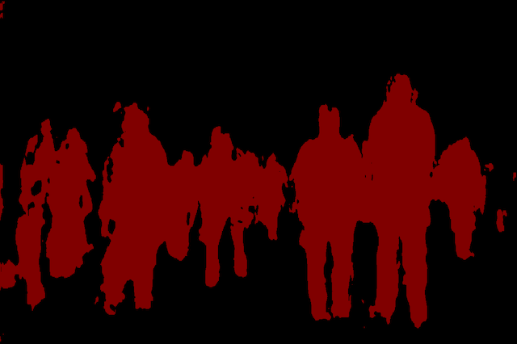
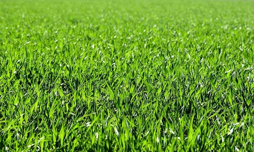
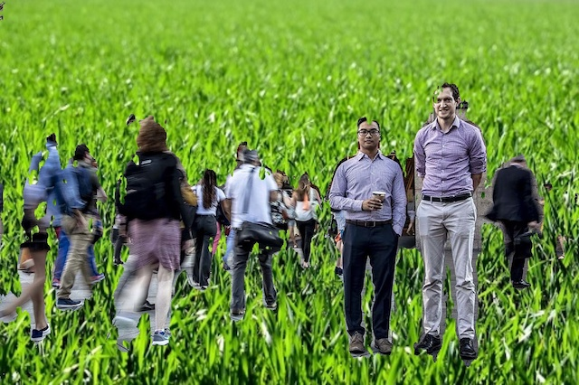

## Python + ESPNetをオリジナルデータで学習する(学習編)
セマンティックセグメンテーションの中で軽いモデルであるESPNetv2を実装します．<br>
本稿ではPython + ESPNetで学習した人を検出するセマンティックセグメンテーションのモデルを使って，クロマキー合成を実施します．<br>
今回はGoogle ColabとGoogle Driveを連携させて，notebook形式で実行してます．<br>

> Google Colaboratory（以下Google Colab）は、Google社が無料で提供している機械学習の教育や研究用の開発環境です。開発環境はJupyter Notebookに似たインターフェースを持ち、Pythonの主要なライブラリがプリインストールされています。<br>
引用元：[Google Colabの使い方](https://interface.cqpub.co.jp/ail01/)

最終的に，人以外の背景を着色して，zoomのバーチャル背景機能のようなクロマキー合成を実装したいです．<br>


## 作業ディレクトリのファイル構成
プロジェクトディレクトリはsegmentationとしています．度々，省略しています．
```init
segmentation
├── /EdgeNets
│   ├── /results_segmentation <- モデルの出力ディレクトリ
│   │   └── /human_city
│   ├── /result_images <- 着色画像の出力ディレクトリ
│   │   └── /sample_images_org
│   │       ├── sample3.png
│   │       ├── mask_sample3.png
│   │       └── (省略)
│   ├── /sample_images <- サンプル画像
│   │   ├── sample3.png
│   │   └── (省略)
│   ├── grass.jpg <- 背景画像
│   ├── chromakey.jpg <- クロマキー合成画像
│   ├── train_segmentation.py
│   ├── test_segmentation.py
│   ├── custom_test_segmentation.py
│   ├── custom_train_segmentation.py
│   └── (省略)
└── ESPNetv2.ipynb <- 実行用ノートブック
```

## クロマキー合成
### マスク画像の生成
クロマキー合成をするには，まず人だけが着色されているマスク画像を出力する必要があります．<br>
そこでマスク画像も出力されるように，`custom_test_segmentation.py`を改良します．

```python
# custom_test_segmentation.py
# 60行目から68行目付近
import torch
import glob
import os
from argparse import ArgumentParser
from PIL import Image
from torchvision.transforms import functional as F
from tqdm import tqdm
from utilities.print_utils import *
from transforms.classification.data_transforms import MEAN, STD
from utilities.utils import model_parameters, compute_flops

# ===========================================
__author__ = "Sachin Mehta"
__license__ = "MIT"
__maintainer__ = "Sachin Mehta"
# ============================================

IMAGE_EXTENSIONS = ['.jpg', '.png', '.jpeg']

def data_transform(img, im_size):
    img = img.resize(im_size, Image.BILINEAR)
    img = F.to_tensor(img)  # convert to tensor (values between 0 and 1)
    img = F.normalize(img, MEAN, STD)  # normalize the tensor
    return img


def evaluate(args, model, image_list, device):
    im_size = tuple(args.im_size)

    # get color map for dataset
    from utilities.color_map import VOCColormap
    cmap = VOCColormap(num_classes=args.num_classes).get_color_map_voc()
    print(cmap)
    

    model.eval()
    for i, imgName in tqdm(enumerate(image_list)):
        img = Image.open(imgName).convert('RGB')
        img_clone = img.copy()
        w, h = img.size

        img = data_transform(img, im_size)
        img = img.unsqueeze(0)  # add a batch dimension
        img = img.to(device)
        img_out = model(img)
        img_out = img_out.squeeze(0)  # remove the batch dimension
        img_out = img_out.max(0)[1].byte()  # get the label map
        img_out = img_out.to(device='cpu').numpy()
        
        img_out = Image.fromarray(img_out)
        # resize to original size
        img_out = img_out.resize((w, h), Image.NEAREST)
        
        # pascal dataset accepts colored segmentations
        img_out.putpalette(cmap) # クラスごとに着色
        img_out = img_out.convert('RGB')
        blended = Image.blend(img_clone, img_out, alpha=0.7)

        # save the segmentation blend image
        name = imgName.split('/')[-1]
        img_extn = imgName.split('.')[-1]
        blend_name = '{}/{}'.format(args.savedir, name.replace(img_extn, 'png'))
        blended.save(blend_name)
        # save the segmentation mask image
        mask_name = '{}/mask_{}'.format(args.savedir, name.replace(img_extn, 'png'))
        img_out.save(mask_name)


def main(args):
    # read all the images in the folder
    if args.dataset == 'custom':
        if args.split in ['train', 'val', 'test']:
            image_list = []
            for extn in IMAGE_EXTENSIONS:
                image_path = os.path.join(args.data_path, args.split, "rgb", '*' + extn)
                image_list = image_list +  glob.glob(image_path)[0:50]
            seg_classes = args.num_classes
            
        elif args.split == 'custom':
            image_list = []
            for extn in IMAGE_EXTENSIONS:
                image_path = os.path.join(args.data_path, '*' + extn)
                image_list = image_list +  glob.glob(image_path)
            seg_classes = args.num_classes
            
        else:
            print_error_message('{} split not yet supported'.format(args.split))
            
    else:
        print_error_message('{} dataset not yet supported'.format(args.dataset))

    if len(image_list) == 0:
        print_error_message('No files in directory: {}'.format(image_path))

    print_info_message('# of images for testing: {}'.format(len(image_list)))

    if args.model == 'espnetv2':
        from model.segmentation.espnetv2 import espnetv2_seg
        args.classes = seg_classes
        model = espnetv2_seg(args)
    elif args.model == 'dicenet':
        from model.segmentation.dicenet import dicenet_seg
        model = dicenet_seg(args, classes=seg_classes)
    else:
        print_error_message('{} network not yet supported'.format(args.model))
        exit(-1)

    # mdoel information
    num_params = model_parameters(model)
    flops = compute_flops(model, input=torch.Tensor(1, 3, args.im_size[0], args.im_size[1]))
    print_info_message('FLOPs for an input of size {}x{}: {:.2f} million'.format(args.im_size[0], args.im_size[1], flops))
    print_info_message('# of parameters: {}'.format(num_params))

    if args.weights_test:
        print_info_message('Loading model weights')
        weight_dict = torch.load(args.weights_test, map_location=torch.device('cpu'))
        model.load_state_dict(weight_dict)
        print_info_message('Weight loaded successfully')
    else:
        print_error_message('weight file does not exist or not specified. Please check: {}', format(args.weights_test))

    num_gpus = torch.cuda.device_count()
    device = 'cuda' if num_gpus > 0 else 'cpu'
    model = model.to(device=device)

    evaluate(args, model, image_list, device=device)


if __name__ == '__main__':
    from commons.general_details import segmentation_models, segmentation_datasets

    parser = ArgumentParser()
    # mdoel details
    parser.add_argument('--model', default="espnetv2", choices=segmentation_models, help='Model name')
    parser.add_argument('--weights-test', default='', help='Pretrained weights directory.')
    parser.add_argument('--s', default=2.0, type=float, help='scale')
    # dataset details
    parser.add_argument('--data-path', default="", help='Data directory')
    parser.add_argument('--dataset', default='custom', choices=['custom'], help='Dataset name')
    # input details
    parser.add_argument('--im-size', type=int, nargs="+", default=[512, 256], help='Image size for testing (W x H)')
    parser.add_argument('--split', default='val', choices=['train', 'val', 'test', 'custom'], help='data split')
    parser.add_argument('--model-width', default=224, type=int, help='Model width')
    parser.add_argument('--model-height', default=224, type=int, help='Model height')
    parser.add_argument('--channels', default=3, type=int, help='Input channels')
    parser.add_argument('--num-classes', default=20, type=int,
                        help='ImageNet classes. Required for loading the base network')
    parser.add_argument('--savedir-name', default='demo', type=str,
                        help='Save folder location')

    args = parser.parse_args()

    if not args.weights_test:
        from model.weight_locations.segmentation import model_weight_map

        model_key = '{}_{}'.format(args.model, args.s)
        dataset_key = '{}_{}x{}'.format(args.dataset, args.im_size[0], args.im_size[1])
        assert model_key in model_weight_map.keys(), '{} does not exist'.format(model_key)
        assert dataset_key in model_weight_map[model_key].keys(), '{} does not exist'.format(dataset_key)
        args.weights_test = model_weight_map[model_key][dataset_key]['weights']
        if not os.path.isfile(args.weights_test):
            print_error_message('weight file does not exist: {}'.format(args.weights_test))

    # set-up results path
    if args.dataset == 'custom':
        if args.split in ['train', 'val', 'test']:
            args.savedir = 'results_images/{}_{}'.format(args.dataset, args.split)
        elif args.split == 'custom':
            args.savedir = 'results_images/{}'.format(args.savedir_name)
        else:
            print_error_message('{} split not yet supported'.format(args.split))
            
    else:
        print_error_message('{} dataset not yet supported'.format(args.dataset))

    if not os.path.isdir(args.savedir):
        os.makedirs(args.savedir)

    # This key is used to load the ImageNet weights while training. So, set to empty to avoid errors
    args.weights = ''

    main(args)
```

以下のコマンドでテストを実行し，マスク画像を生成します．
```python
%cd /content/drive/My\ Drive/segmentation/EdgeNets
!CUDA_VISIBLE_DEVICES=0 python custom_test_segmentation.py \
                              --model espnetv2 \
                              --s 2.0 \
                              --dataset custom \
                              --data-path ./sample_images/ \
                              --split custom \
                              --im-size 1024 512\
                              --num-classes 2 \
                               --weights-test ./results_segmentation/human_city/model_espnetv2_custom/s_2.0_sch_hybrid_loss_ce_res_1024_sc_0.35_1.0/＊＊＊/espnetv2_2.0_1024_best.pth \
                               --savedir-name sample_images_org
```

マスク画像<br>
<br>

### クロマキー合成
クロマキー合成は実際のオリジナル画像，マスク画像，背景画像の3つで実装できます．<br>
マスク画像は白と黒の2色である必要があるので，以下のコードでは色置換も実施しています．<br>

オリジナル画像<br>
<br>

マスク画像<br>
<br>

背景画像<br>
<br>

以下のコードでクロマキー合成が実行できます．
```python
#　作業ディレクトリ：/content/drive/My\ Drive/segmentation/EdgeNets
import cv2
import numpy as np

# マスク画像の読み込み
mask = cv2.imread('./results_images/sample_images_org/mask_sample3.png')
# 特定の色(0, 0, 128)を別の色(255, 255, 255)に置換する
before_color = [0, 0, 128]
after_color = [255, 255, 255]
mask[np.where((mask == before_color).all(axis=2))] = after_color

# オリジナル画像
org = cv2.imread('./sample_images/sample3.jpg')
h, w, _ = org.shape

# 背景画像
back = cv2.imread('grass.jpg')
back = cv2.resize(back, (w, h) )

# クロマキー合成
dst = np.where(mask[:, :] == 0, back, org)
# 保存
cv2.imwrite('chromakey.jpg', dst)

# google colab用の画像表示コード
from google.colab.patches import cv2_imshow
cv2_imshow(dst)
```

クロマキー合成画像<br>
<br>

## まとめ
本稿ではPython + ESPNetで学習した人を検出するセマンティックセグメンテーションのモデルを使って，クロマキー合成を実施しました．<br>
今度は，違うモデルで実施してみたいです．


## 参考サイト
[sacmehta/EdgeNets](https://github.com/sacmehta/EdgeNets)<br>
[sacmehta/EdgeNets/README_Segmentation.md](https://github.com/sacmehta/EdgeNets/blob/master/README_Segmentation.md)
[ESPNetで自作データセットを学習してセグメンテーション](https://qiita.com/tokyokuma/items/37b1370ea7c84399fbb9)<br>
[【python/OpenCV】画像の特定の色を抽出する方法](https://rikoubou.hatenablog.com/entry/2019/02/21/190310)<br>
[PIL/Pillowで画像の色を高速に置換する](https://qiita.com/pashango2/items/d6dda5f07109ee5b6163)<br>
[【OpenCV】 forループを使わずに指定した色を別の色に変更する](http://ni4muraano.hatenablog.com/entry/2017/05/15/000000)<br>
[OpenCV – マスク画像を利用した画像処理について](https://pystyle.info/opencv-mask-image/)